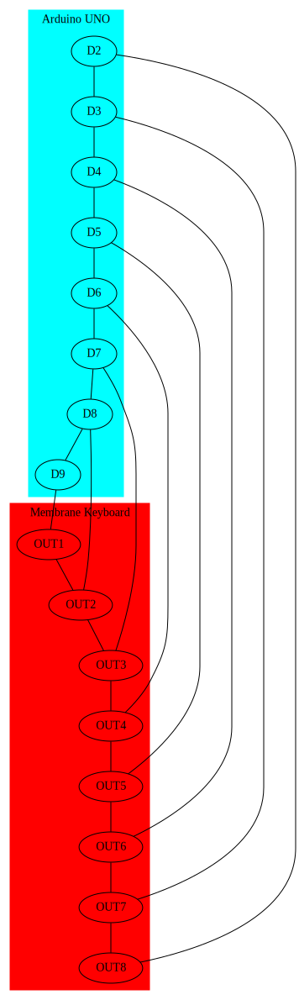

# What's this?

- Write the ASCII characters corresponding to the input of two buttons to a serial monitor.

### Requires:

- Hardware
   - Arduino UNO (if you're using Arduino CLI, update sketch.yaml if using another board or device port)
   - Membrane 4x4 keyboard

- Software
   - Keypad.h library
   - Serial monitor

### Pinout: 

### Notes

- '#' button is used as 'E' character
- '*' button is used as 'F' character
