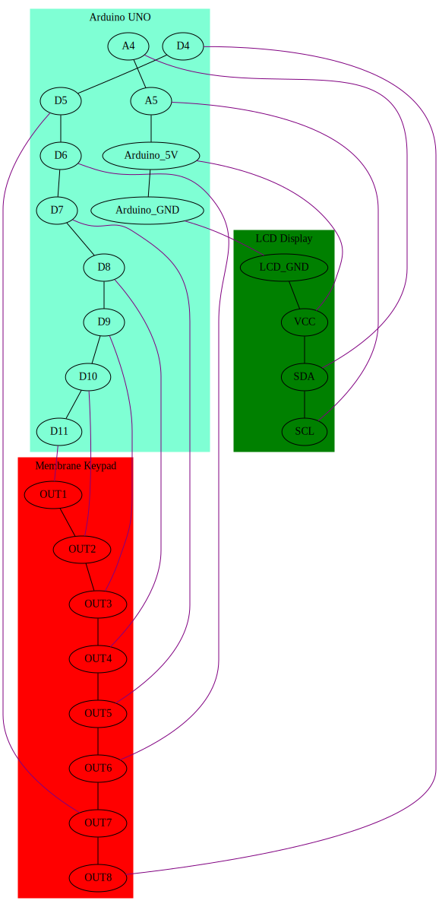

# What's this?

- Write characters through ASCII codes by typing on a membrane keypad, then see it displayed on the LCD display.

### Requires:

- Hardware

   - Arduino UNO (if you're using Arduino CLI, update sketch.yaml if using another board or device port)
   - 4x4 membrane matrix keypad
   - LCD display with I2C module

- Software

   - LiquidCrystal_I2C.h library

### Pinout:

;

### Notes:

- '#' button is used as 'E' character
- '*' button is used as 'F' character
- Filling the display with characters clears it
- Display is treated as a single line: carriage return ASCII code 0D clears it.
